# 헤드퍼스트 디자인패턴

## 취지

- 서적 내 디자인 패턴 내용 정리
- 서적 내 코드를 Typescript 기반으로 작성

## 구조

- patterns 하위에 각 패턴 별 디렉토리 구성
- 각 패턴 디렉토리 내 index.spec.ts 기준 테스트 코드 실행

## 디자인 원칙

서적 내에서 다루는 순서에 따라 나열함

### [1] 바뀌는 부분은 캡슐화한다

향후 새로운 요구사항에 따라 변경될 여지가 있는 부분을 파악하여 분리(캡슐화)한다. 이를 통해 추후 수정사항이 발생하여도 캡슐화를 통해 독립된 부분을 수정하게 되므로 의도치 않은 부수 효과를 억제할 수 있고 유연성(확장성)도 얻게 된다.

모든 패턴은 ‘시스템의 일부분을 다른 부분과 독립적으로 변화시킬 수 있는’ 방법을 제공한다. 그러므로 이 원칙은 디자인 패턴의 기반이 되는 원칙이다.

### [2] 구현보다는 인터페이스에 맞춰서 프로그래밍한다

객체 내부에서 특정 행동을 구현하지 않고, 인터페이스(대표 행동 시그니처를 정의한 것)를 통해 행동을 표현하여 객체는 이 인터페이스를 할당받아 사용한다. 행동은 인터페이스에 맞추어 별도의 구현체로 구현된다.

즉 행동이 객체 내부에 고정되지 않고 상위 형식(supertype)에 맞춰 프로그래밍하여 다형성을 활용한다.

이런 식으로 디자인하면 새로운 행동이 필요할 때, 기존 객체에 영향을 주지 않고 독립적으로 행동을 수정할 수 있어 유연성이 늘고, 다른 형식의 객체에서도 행동을 재사용할 수 있다.

객체지향 관점에서 클래스는 상태와 메소드를 가지고 있으며, 메소드 수준인 행동을 클래스로 분리하는 것이 자칫 어색할 수 있으나, 행동에도 상태와 메소드가 포함되어 있으므로 클래스로 분리되어 작성할 수 있다.

코드의 응집력을 높이고 결합도를 낮추는 데 효과적이다.

예시

- ‘요리’ 객체에서 ‘가열’에 대한 행동이 필요할 경우, ‘가열’에 대한 인터페이스를 통해 요리 객체에서는 ‘가열’의 수단은 신경 쓰지 않고 오직 ‘열이 가해지는 행위’에만 집중한다.

- ‘가열’ 인터페이스는 ‘직화’, ‘삶기’, ‘훈제’ 등 다양한 가열 방식에 따라 여러 구현체로 나뉘고, 구체적인 구현은 이 ‘가열’ 인터페이스의 구현체로 작성된다. 이후 용도에 맞게 ‘요리’ 객체에 이 인터페이스 규칙에 맞는 ‘가열’ 구현체를 할당하여 사용하면 된다.

- ‘가열’ 객체는 ‘요리’ 객체뿐 아니라 ‘가열’을 필요로 하는 다른 객체, 예를 들면 ‘세탁’ 객체의 ‘삶음 세탁’을 위한 ‘가열-삶기’ 구현체를 재사용할 수 있다.

  

### [3] 상속보다는 구성을 활용한다

객체에서 필요한 행동을, 상속을 통해 행동을 사용하는 대신 올바른 행동 객체를 참조 값으로 관리하여 행동을 부여(위임)받는 것이 유연성을 크게 향상할 수 있다. 이런 식으로 클래스를 합치는 것을 구성(composition)이라 부른다.

행동(알고리즘군)을 별도의 객체 집합으로 캡슐화(원칙 [2])하고, 이를 구성 요소로 사용하는 객체에서 올바르게 구현한다면, 실행 중에도 접근자를 통해 행동을 변경할 수 있다.

예시

- ‘요리’에서 객체 구성 시 필요에 따라 ‘가열’알고리즘군 중 필요한 구현체를 택하여 객체 내부의 참조 값으로 구성한다.
- 가열()을 호출하기 위해 참조 값을 통해 가열()을 호출한다. 이를 위임이라 부른다.
- ‘요리-동파육’의 경우 2가지 다른 형식의 가열이 필요하며, 이를 올바르게 구현했을 경우, 첫 조리에서는 ‘튀김’ 기능을 통해 조리한 이후, 조리방식 참조 값을 ‘찜’으로 바꾸어 ‘찜’ 방식으로 2번째 가열을 수행할 수 있게 된다.

  

### [4] 상호작용하는 객체 사이에는 가능하면 느슨한 결합을 사용해야한다

서로 상호작용하는 객체 간, 상호작용을 위한 정보 이외의 정보를 모르는 것을 의미하며, 이는 곧 낮은 결합도를 뜻한다. 즉, 느슨한 결합을 활용하면 유연성이 좋아진다.

객체 사이의 상호의존성을 최소화하여 변경 사항이 생겨도 대응할 수 있는 유연한 객체지향 시스템을 구축할 수 있게 된다.

### [5] 개방/폐쇄 원칙(OCP, Open/Close Principle)

클래스는 확장에는 열려 있어야 하지만 변경에는 닫혀 있어야 한다. (p.120)

"확장에는 열려 있어야 한다" -> 새로운 기능(행동)을 쉽게 확장할 수 있다.
"변경에는 닫혀 있어야 한다" -> 기존 코드를 수정하지 않는다.

기존 코드를 수정하지 않고 확장으로 새로운 행동을 추가하는 것을 의미한다. 코드에서 확장해야 할 부분을 선택할 때는 세심한 주의가 필요하다. 무조건 OCP를 적용할 경우 필요 이상의 복잡도로 인해 유지보수가 어려워지는 부작용이 발생할 수 있다.

    개방-폐쇄 원칙(Open-Closed Principle), 소프트웨어 개체는 확장에는 열려 있어야 하고, 변경에는 닫혀 있어야 한다.
    다시 말해 소프트웨어 개체의 행위는 확장할 수 있어야 하지만, 이때 산출물을 변경해서는 안 된다.
    [클린 아키텍처, 로버트 C. 마틴 저, p.74 인용]

### [6] 의존성 뒤집기 원칙

추상화된 것에 의존하게 만들고 구상 클래스에 의존하지 않게 많든다 (DIP) (p.173)

"디자인 원칙 [2], 구현보다는 인터페이스에 맞춰서 프로그래밍한다"와 같다고 생각될 수 있지만, 의존성 역전 원칙에서는 추상화를 보다 많이 강조한다.
이 원칙에는 고수준 구성 요소가 저수준 구성 요소에 의존하면 안 되며, 항상 추상화에 의존하게 만들어야 한다는 뜻이 담겨 있다.

의존성 역전 원칙에 따르면, 구상 클래스처럼 구체적인 것이 아닌 추상 클래스나 인터페이스와 같이 추상적인 것에 의존하는 코드를 만들어야 한다. 이 원칙은 고수준 모듈과 저수준 모듈에 모두 적용될 수 있다.

    의존성 역전 원칙(Dependency Inversion Principle)에서 말하는, 유연성이 극대화된 시스템이란 소스 코드 의존성이 추상(abstraction)에 의존하며 구체(concreation)에는 의존하지 않는 시스템이다.
    DIP를 논할 때 운영체제나 플랫폼같이 안정성이 보장된 환경에 대해서는 무시하는 편이다. 이 환경에 대한 의존성은 용납하는데, 변경되지 않는다면 의존할 수 있다는 사실을 이미 알고 있기 때문이다.
    의존하지 않도록 피하고자 하는 것은 바로 변동성이 큰(Volatile) 구체적인 요소다. 그리고 이 구체적인 요소는 개발하는 중이라면 변경될 수밖에 없는 모듈들이다.
    [클린 아키텍처, 로버트 C. 마틴 저, p.92 인용]

의존성 뒤집기 원칙을 지키는 방법

- 변수에 구상 클래스의 레퍼런스를 저장하지 않는다.
- 구상 클래스에서 유도된 클래스를 만들지 않는다.
- 베이스 클래스에 이미 구현되어 있는 메소드를 오버라이드 하지 않는다.

### [7] 최소 지식 원칙

진짜 절친에게만 이야기해야 한다. (p.301)

### [8] 헐리우드 원칙

먼저 연락하지 마세요. 저희가 연락 드리겠습니다. (p.332)

### [9] 단일 역할 원칙

어떤 클래스가 바뀌는 이유는 하나뿐이어야 한다. (p.374)

## 작성한 디자인 패턴

- [x] [전략 패턴 / Strategy](./patterns/strategy/)
- [x] [옵저버 패턴 / Observer](./patterns/observer/)
- [x] [데코레이터 패턴 / Decorator](./patterns/decorator/)
- [x] [팩토리 패턴 / Factory](./patterns/factory/)
- [x] [싱글턴 패턴 / Singleton](./patterns/singleton/)
- [x] [커맨드 패턴 / Command](./patterns/command/)
- [ ] [어댑터 패턴 / Adapter](./patterns/adapter/)
- [ ] [퍼사드 패턴 / Facade](./patterns/facade/)
- [ ] [탬플릿 메소드 패턴 / Template Method](./patterns/templatemethod)
- [ ] [반복자 패턴 / Iterator](./patterns/iterator/)

## 참고 자료

### 서적

- [헤드 퍼스트 디자인 패턴](https://product.kyobobook.co.kr/detail/S000001810483)
- [GoF의 디자인 패턴](https://product.kyobobook.co.kr/detail/S000001962303)
- [클린 아키텍처](https://product.kyobobook.co.kr/detail/S000001033082)

### 온라인

- https://refactoring.guru/ko/design-patterns
- https://www.inflearn.com/course/%EB%94%94%EC%9E%90%EC%9D%B8-%ED%8C%A8%ED%84%B4
