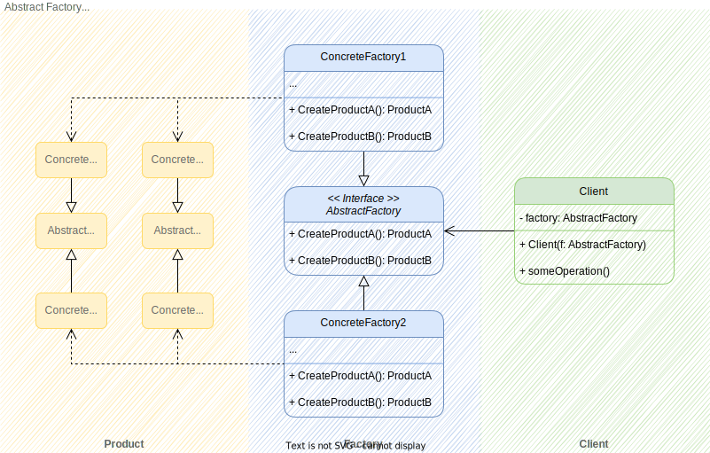

# 추상 팩토리 패턴 (Abstract Factory Pattern)

## 개념

### Head First 디자인 패턴

추상 팩토리 패턴(Abstract Factory Pattern)은 구상 클래스에 의존하지 않고도 서로 연관되거나 의존적인 객체로 이루어진 제품군을 생산하는 인터페이스를 제공합니다. 구상 클래스는 서브클래스에서 만듭니다.

### GoF의 디자인 패턴

구체적인 클래스를 지정하지 않고 관련성을 갖는 객체들의 집합을 생성하거나 서로 독립적인 객체들의 집합을 생서할 수 있는 인터페이스를 제공하는 패턴입니다.

## 요약

클라이언트에서 추상 팩토리 패턴 인터페이스를 통해 구상 클래스를 구현하여, 추후 제품군 변화로부터 해방될 수 있다.

- 제품군 인터페이스, 제품군 구상 클래스, 추상 팩토리 패턴 인터페이스(팩토리 인터페이스), 팩토리 구상 클래스 간 각각의 관계를 명확히 분리하는 것이 관건.
- 추상 팩토리 패턴 인터페이스는 제품군 인터페이스를 따라 인터페이스 선언한다.
- 제품군 구상 클래스는 제품군 인터페이스에 따라 구현한다.
- 팩토리 구상 클래스는 추상 팩토리 패턴 인터페이스에 따라 구현한다.
- 위 과정을 통해 팩토리 구상 클래스는 제품군 구상 클래스 내부 정보를 알 필요가 없다.
- 최종적으로 클라이언트에서 사용해야 할 제품군에 대한 제어를, 추상 팩토리 패턴 인터페이스를 통해 사용할 제품군 인터페이스를 제어하도록 유도하는 것이다.
- 클라이언트에서 팩토리의 타입은 추상 팩토리 패턴 인터페이스이지만, 실제로 인스턴스를 생성하는 것은 팩토리 구상 클래스이기 때문에, 팩토리 구상 클래스 자체가 추가/삭제될 경우의 클라이언트 코드 수정은 불가피하다.
- 반드시 추상 클래스나 인터페이스를 통해 구현해야 하는 제한은 없으며, 개발 여건에 따라 다소 차이가 있다.

## 설명

추상 팩토리 패턴의 목적 자체가 팩토리에서 인스턴스를 생성하는 코드를 인터페이스 기반으로 구성하도록 도와주는 패턴이기에 팩토리(인스턴스 생성) 관점에서 보면 팩토리 메소드 패턴과 유사하지만, 이에 더하여 클라이언트에서 사용하는 부분까지 함께 고려한 패턴이다.

팩토리 메소드 패턴에서 남아있던 문제. 즉, 제품군 추가 시 발생하는 클라이언트 코드의 수정을 억제하고, 유연한 확장성을 얻기 위한 클라이언트 코드에서 구상 클래스를 사용하지 않도록 보강하는 것이다.

### 구조

  

위 이미지처럼 추상 팩토리 패턴은 크게 제품군(Product), 팩토리(Factory), 클라이언트(Client) 영역으로 나뉜다.

추상 팩토리 패턴을 구현 방식은 다음과 같이 4가지 절차를 따른다.

1. 추상 팩토리 패턴은 우선 대상이 되는 제품군을 정리하여 명확한 인터페이스(AbstractProduct*)를 정의하는 것이다. 이후 파생 제품군(ConcreteProduct*)은 모두 이 제품군 인터페이스를 따르도록 제한한다.

2. 위 과정을 통해 제품군 인터페이스가 확정되면, 추상 팩토리 패턴을 선언해야 한다. 이 추상 팩토리 패턴은 앞으로 팩토리에서 제품군을 활용할 명확한 인터페이스를 뜻한다.

3. 위 추상 팩토리 패턴(인터페이스)을 따라 생산해야 할 제품군 일체를 다루는 생산부 클래스를 작성한다.

4. 클라이언트 코드는 (2)에서 선언한 인터페이스를 사용하여 상세 항목을 기술하기 때문에, (1)과 (3)에서 다루는 생산부 클래스와 제품군에 관한 정보를 알 필요가 없다. 단지 추상 팩토리 패턴 인터페이스 형식에 맞추어 코드를 구현해두면 향후 제품 변경 사항과는 독립적으로 유지할 수 있다.

### 예제 코드 기준 설명

  

1. [좌측 Product 영역] <\<Interface>>Dough, <\<Interface>>Sauce, <\<Interface>>Cheese 등 제품군 인터페이스는 각 연관 제품군 별 공용 인터페이스를 추출해 정의한다.
2. [좌측 Product 영역] 제품군 구상 클래스는 위 제품군 인터페이스를 따르는 다양한 세부 구현이다. Dough의 경우 스타일에 따라 ThickCrustDough, ThinCrustDough로 나뉜다. 모든 식재료 구상 클래스는 제품군 인터페이스를 통해 구현되어야 한다.
3. [중앙 Factory 영역] <\<Interface>>PizzaIngredientFactory는 각 제품군 인터페이스를 통해 사용해야 할 메소드 집합을 구성하여 인터페이스를 구현한다.
4. [중앙 Factory 영역] NYPizzaIngredientFactory, ChicagoPizzaIngredientFactory 등 팩토리 구상 클래스에서 인터페이스에 따라 생성 메소드를 구현한다.
5. [우측 Client 영역] PizzaStore는 PizzaIngredientFactory 타입으로 선언된 팩토리 값으로 NYPizzaIngredientFactory와 같은 구상 클래스를 전달 받고, PizzaIngredientFactory 인터페이스에 정의된 내용을 통해 PizzaStore 내부 구상 클래스를 작성한다.

일종의 의존성 주입(dependency injection)이라고 볼 수 있다. 구현 방식에 따라 다소 차이가 있지만 이 예제에서 PizzaStore.orderPizza 내부는 전달받은
PizzaIngredientFactory를 통해 스타일에 따른 피자 재료와 같은 사항에 의존적이지 않은 상태를 유지할 수 있다.
orderPizza는 인터페이스로 구현된 PizzaIngredientFactory를 통해 구현되어, 이후에 피자 재료에 변경이 생기더라도 orderPizza 코드에는 영향을 주지 않을 수 있어 유연성을 갖게 된다.

### 장점

- 팩토리에서 생성되는 제품들의 상호 호환성이 보장된다.
- 제품군 구상 클래스와 클라이언트 코드의 결합을 피할 수 있다.
  // Todo: 추후 링크 연결
- 단일 책임 원칙[]. 제품 생성 코드를 한곳으로 모아 응집력이 높아진다.
  // Todo: 추후 링크 연결
- 개방/폐쇄 원칙. 클라이언트 코드 수정 없이 제품군 수정을 유연하게 할 수 있다.

### 단점

- 새로운 인터페이스와 클래스가 많이 도입되기 때문에 복잡도가 높아진다.
